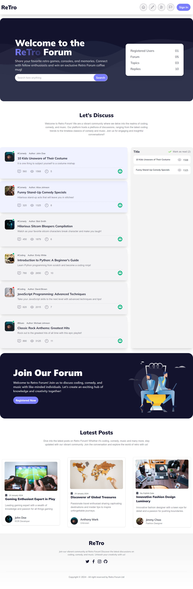

# Retro Forum Website

**[View the live project here.](https://n-retro-forumg.netlify.app/)**

## Project Description

This is a retro-style forum website where users can view and post about various topics.

## APIs

I utilized the following APIs for this project:

- **LatestPosts:** [https://openapi.programming-hero.com/api/retro-forum/latest-posts](https://openapi.programming-hero.com/api/retro-forum/latest-posts)
- **AllPosts:** [https://openapi.programming-hero.com/api/retro-forum/posts](https://openapi.programming-hero.com/api/retro-forum/posts)
- **PostSearchByQuery:** [https://openapi.programming-hero.com/api/retro-forum/posts?category=categoryName](https://openapi.programming-hero.com/api/retro-forum/posts?category=categoryName)

### Example

To search for posts in the "coding" category, you would use the following URL:
[https://openapi.programming-hero.com/api/retro-forum/posts?category=coding](https://openapi.programming-hero.com/api/retro-forum/posts?category=coding)

## Technologies Used

This project was built using the following technologies:

- **HTML**
- **CSS** (utilizing Tailwind CSS and DaisyUI)
- **JavaScript**

## Responsive Design

The website is designed to be responsive, providing a seamless experience across different devices and screen sizes.

## Styling

The website features a retro-inspired design, with a focus on simplicity and usability.

## Banner Image

## Features

- View the latest posts
- Search for posts by category
- View all posts
- Post new content

## Development Process

I followed an iterative development process, starting with a basic layout and adding features and styling incrementally.

## Challenges Faced

One of the main challenges I faced was ensuring the website was responsive across different devices and screen sizes.

## Future Improvements

In the future, I plan to add more features such as user authentication and the ability to comment on posts.

## Conclusion

I'm proud of how this project turned out and I hope you enjoy using it. Please feel free to leave any feedback or suggestions for improvements.
